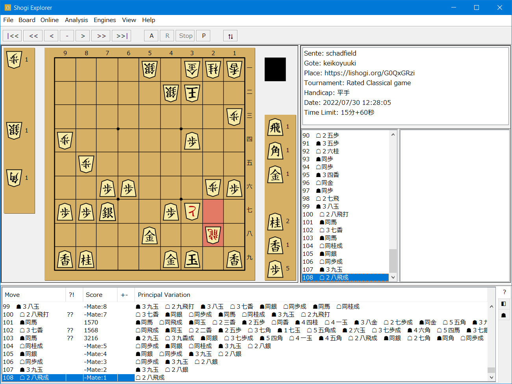
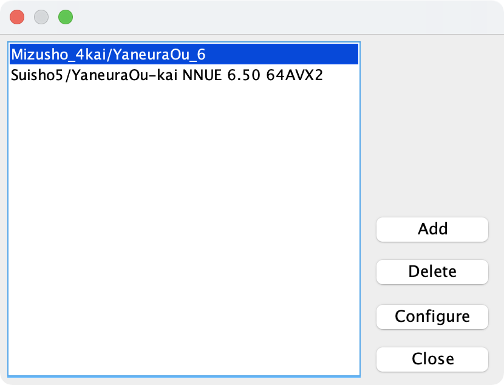
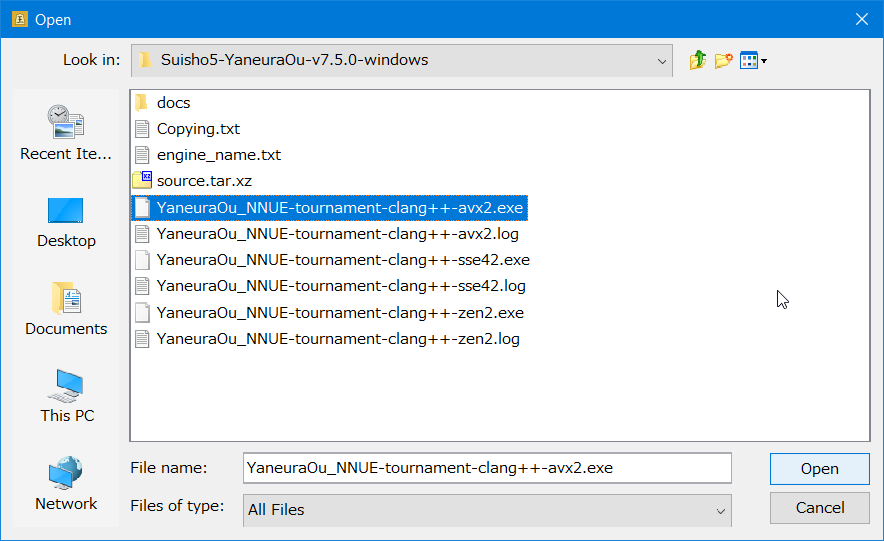
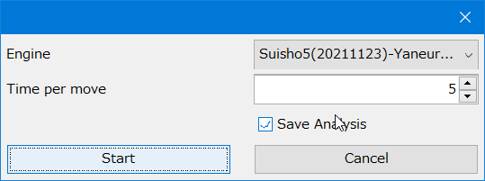
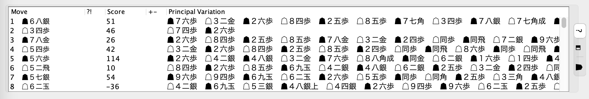
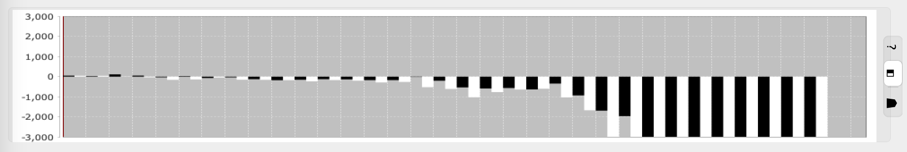
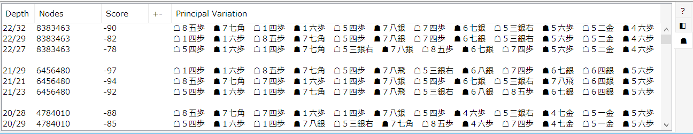
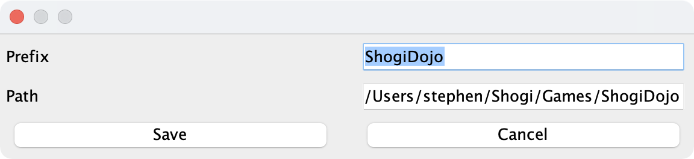

# Shogi Explorer

## Introduction

Shogi Explorer is an application which allows Shogi players to analyse game records using a Shogi game engine. It works on macOS, Windows and Linux.

## Installation

Shogi Explorer requires a Java 17 runtime to be installed prior to use. I recommend installing OpenJDK 17 from https://adoptium.net/.

## Game Records

The game records must be in UTF-8 or Shift JIS KIF format such as those that can be downloaded from popular online Shogi website http://www.81dojo.com/. They can be loaded from a file on disk, imported directly from the system clipboard or published via HTTP like live games on https://www.shogi.or.jp/game/.

## Shogi Game Engine

Any USI compliant game engine may be used such as YaneuraOU. Engines can be added and configured using the Engine Manager.

Click "Add" then select the engine executable file using the file chooser.

## Game Analyser

Using the Game Analyser you can choose which engine to use, how many seconds to spend analysing each move and save the analysis to a file (extension ".kaf") which will be automatically loaded next time the game record is loaded.

The analysis tab will show the score, in centipawns,  evaluated by the engine for each position and identify weak moves (?) and blunders (??). The engine's preferred line - the Principle Variation - is shown and can be displayed on the board by selecting a line in the analysis pane and using the RIGHT and LEFT arrow keys.

The score is plotted as an XY chart in the graph tab.

## Position Analysis

Single positions can be analysed using an engine's "infinite" mode which runs until the analysis is halted by the user. If "multipv" is enabled in the engine configuration then multiple best lines will be calculated and can be displayed on the board via the position analysis tab.

## Board Editor

The position on the board can be edited and then that position may be analysed using the position analyser. When board edit mode is enabled the keyboard commands for the board editor are shown in the game comment area.

delete: x 
clear_board: c 
piece: p|l|k|s|g|b|r|k|P|L|K|S|G|B|R|K 
promoted_piece: m\<piece\> 
komadai_piece: \<0-18\>\<piece\> 

## Saving Game Records

Game records can now be saved for games opened using the import clipboard feature. There is a special Fast Save option which saves game records to a preferred directory using a template: \<prefix\>-\<dateTime\>-\<sente\>-\<gote\>-\<index\>.kif.

The game save function never overwrites an existing file.

## Online Game Monitoring

If the URL for a live game is available, such as for some games on https://www.shogi.or.jp/game/, then Shogi Explorer can monitor the game and refresh the board every 30 seconds. The game analyser now supports a resume function so that when new moves are played during an online game then analysis for those moves may be added to the analysis tab.

## Custom URI Schemes

You can open URIs of the following type:

shogiexplorer://url?<gameUrl>

example:

https://www.shogi-extend.com/w/BOUYATETSU5-kakasihatake-20211226_162732.kif 